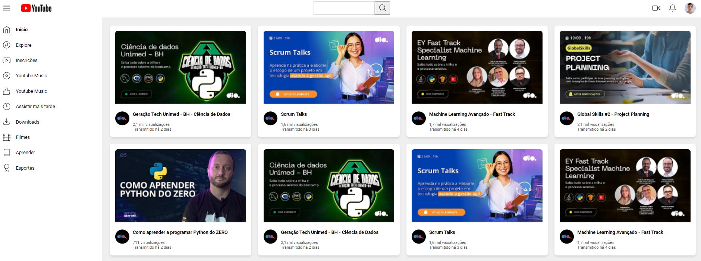

# 📝 Desafio de Projeto CSS: Reproduzindo a Listagem do YouTube com Grid Layout no CSS

Projeto de HTML e CSS para clonar a lista de vídeos da página do YouTube utilizando Grid Layout.  
Este projeto foi proposto pela expert Michele Ambrosio da plataforma educacional DIO na Formação CSS Developer.

## 🛠️ Tecnologias Usadas:

- 
- 

## 🖥 Preview:


## 🚀 Execução desse Projeto:

1. **Clonar Repositório:** Para clonar este projeto, execute o seguinte comando no terminal:
   ```bash
   git clone https://github.com/reynanc/Projeto_grid_videos_yt.git

## 🤔 O que foi feito nesse projeto:
- Criar um clone da página  de Listagem do Youtube utilizando os conceitos de Grid e Flexbox;